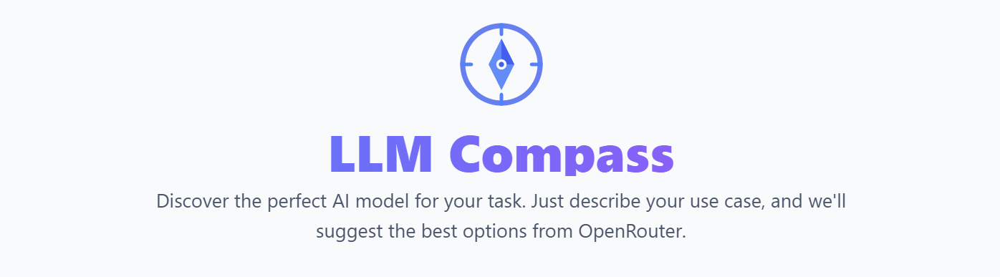
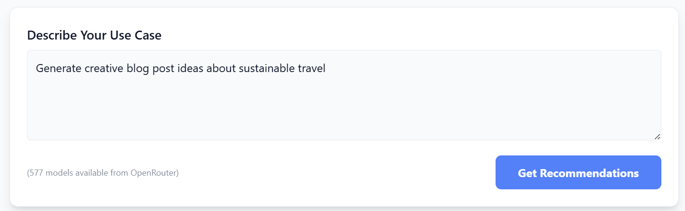

An intelligent tool that helps you find the perfect LLM model for your specific use case. LLM Compass analyzes your requirements and recommends the best models from OpenRouter's extensive database.




## Features

### Completed ✅

- **Smart Recommendations**: AI-powered analysis of your use case to recommend the best LLM models
- **Comprehensive Database**: Access to 570+ models from OpenRouter's frontend API
- **Three-Stage Pipeline**:
  1. LLM-based constraint extraction (semantic understanding)
  2. Deterministic filtering with progressive relaxation
  3. Semantic ranking for final recommendations
- **Modality Support**: Detects and filters models based on input/output modalities (text, image, audio, video, file, embeddings)
- **Context-Aware**: Considers context length requirements for your tasks
- **Cost-Conscious**: Filters models based on pricing when budget constraints are specified
- **Provider Preferences**: Support for preferred/excluded providers (e.g., "open source only")
- **Speed Preferences**: Filter by model size (fast/small vs powerful/large models)
- **Capability Keywords**: Filter models by keywords in name/description
- **Local Storage**: Uses IndexedDB for efficient local caching (no 5MB localStorage limit)
- **Secure Backend**: API keys are securely handled server-side, never exposed to the browser
- **Server-Side Model Caching**: Models cached on backend with 6-hour TTL
- **Results Summary**: Visual display of pipeline metadata (constraints, timing, filtering stats)
- **Loading Animations**: Visual feedback during cache clearing and data sync
- **LM Arena Integration**: Display model rankings from [lmarena.ai](https://lmarena.ai/leaderboard/) leaderboard
  - Rankings shown as badges (🏆🥈🥉) on recommended models
  - Categories: Text, WebDev, Vision, Coding, Math, Creative Writing, etc.
  - Manual refresh available in Settings

### Planned 🚀

- **User Constraint Overrides**: Allow users to manually adjust extracted constraints before filtering
- **Favorite Models**: Save and quickly access preferred models
- **Comparison View**: Side-by-side comparison of recommended models
- **Usage History Analytics**: Insights from recommendation history
- **Export Recommendations**: Export results as JSON/CSV
- **Model Bookmarking**: Bookmark models for later reference
- **Custom Filtering UI**: Advanced filtering interface for power users

## Tech Stack

- **Frontend**: React 19 + TypeScript + Vite
- **Styling**: Tailwind CSS (locally configured)
- **Storage**: IndexedDB (via idb-keyval)
- **Backend**: Node.js + Express
- **AI**: Google Gemini API (via backend proxy)

## Prerequisites

- Node.js (v18 or higher)
- npm or yarn
- A Google Gemini API key

## Setup Instructions

### 1. Install Dependencies

```bash
npm install
```

### 2. Configure Environment Variables

Create a `.env` file in the root directory:

```env
GEMINI_API_KEY=your_gemini_api_key_here
```

**Note**: You can also use `GOOGLE_API_KEY` as an alternative name (both are supported).

**Important**: The API key does NOT need the `VITE_` prefix because:

- The `VITE_` prefix is **only** required for environment variables used in **client-side/browser code** in Vite
- This API key is used in the **backend Node.js server** (using `dotenv`), which reads any environment variable without needing a prefix
- The frontend never accesses the API key directly; it communicates with the backend proxy, which securely handles all Gemini API calls

### 3. Run the Application

Start both the frontend and backend servers:

```bash
npm run dev
```

This will start:

- **Frontend**: Vite dev server on `http://localhost:3000`
- **Backend**: Express server on `http://localhost:3001`

The frontend automatically proxies `/api` requests to the backend.

### Alternative: Run Servers Separately

If you prefer to run them separately:

```bash
# Terminal 1: Backend
npm run server

# Terminal 2: Frontend
npm run client
```

## Project Structure

```
llm-compass/
├── src/
│   ├── components/      # React components (ModelCard, Settings, etc.)
│   ├── services/        # API services (OpenRouter, Gemini)
│   ├── App.tsx          # Main app component
│   ├── main.tsx         # Entry point
│   ├── types.ts         # TypeScript type definitions
│   └── index.css        # Tailwind CSS styles
├── server/
│   └── index.js         # Express backend (API proxy, constraint extraction)
├── data/
│   └── arena-rankings.json  # LM Arena leaderboard data (update monthly)
├── assets/              # Images (logo, banner, screenshots)
├── .env                 # Environment variables (not in git)
├── vite.config.ts       # Vite configuration with proxy
├── tailwind.config.js   # Tailwind CSS configuration
├── AGENT.md             # AI agent maintenance guide
└── package.json         # Dependencies and scripts
```

## Key Features Explained

### Storage Upgrade: IndexedDB

The app was migrated from `localStorage` (5MB limit) to IndexedDB, allowing storage of the complete OpenRouter model database without truncation. All model descriptions and metadata are now stored in full.

### Backend Proxy Pattern

Direct browser calls to the Gemini API are blocked by security restrictions. The app uses a backend proxy pattern:

- Frontend makes requests to `/api/recommend`
- Backend securely handles Gemini API calls
- API key never exposed to the browser

### Three-Stage Recommendation Pipeline

1. **Stage 1 - Constraint Extraction** (LLM: Gemini 2.0 Flash)

   - Semantically analyzes your use case description
   - Extracts structured constraints: modalities, context length, pricing, providers, capability keywords
   - Fast and cheap (~200ms, ~$0.0001/request)
2. **Stage 2 - Deterministic Filtering** (No LLM)

   - Applies extracted constraints to filter the 570+ models
   - Progressive relaxation if filtering is too aggressive
   - Instant execution (<10ms)
3. **Stage 3 - Semantic Ranking** (LLM: Gemini 2.5 Flash)

   - Ranks filtered candidates by semantic fit to your use case
   - Considers price/performance balance and provider reliability
   - Returns top N recommendations with explanations

## Development

### Build for Production

```bash
npm run build
```

### Preview Production Build

```bash
npm run preview
```

## License

MIT License

Copyright (c) 2024 LLM Compass

Permission is hereby granted, free of charge, to any person obtaining a copy
of this software and associated documentation files (the "Software"), to deal
in the Software without restriction, including without limitation the rights
to use, copy, modify, merge, publish, distribute, sublicense, and/or sell
copies of the Software, and to permit persons to whom the Software is
furnished to do so, subject to the following conditions:

The above copyright notice and this permission notice shall be included in all
copies or substantial portions of the Software.

THE SOFTWARE IS PROVIDED "AS IS", WITHOUT WARRANTY OF ANY KIND, EXPRESS OR
IMPLIED, INCLUDING BUT NOT LIMITED TO THE WARRANTIES OF MERCHANTABILITY,
FITNESS FOR A PARTICULAR PURPOSE AND NONINFRINGEMENT. IN NO EVENT SHALL THE
AUTHORS OR COPYRIGHT HOLDERS BE LIABLE FOR ANY CLAIM, DAMAGES OR OTHER
LIABILITY, WHETHER IN AN ACTION OF CONTRACT, TORT OR OTHERWISE, ARISING FROM,
OUT OF OR IN CONNECTION WITH THE SOFTWARE OR THE USE OR OTHER DEALINGS IN THE
SOFTWARE.

## Contributing

Contributions are welcome! Please feel free to submit a Pull Request.

### How to Contribute

1. Fork the repository
2. Create your feature branch (`git checkout -b feature/AmazingFeature`)
3. Commit your changes (`git commit -m 'Add some AmazingFeature'`)
4. Push to the branch (`git push origin feature/AmazingFeature`)
5. Open a Pull Request

### Development Guidelines

- Follow the existing code style and conventions
- Write clear, descriptive commit messages
- Add comments for complex logic
- Test your changes before submitting
- Update documentation as needed

### Reporting Issues

If you find a bug or have a feature request, please open an issue on GitHub with:

- A clear description of the problem or feature
- Steps to reproduce (for bugs)
- Expected vs actual behavior
- Any relevant error messages or screenshots
